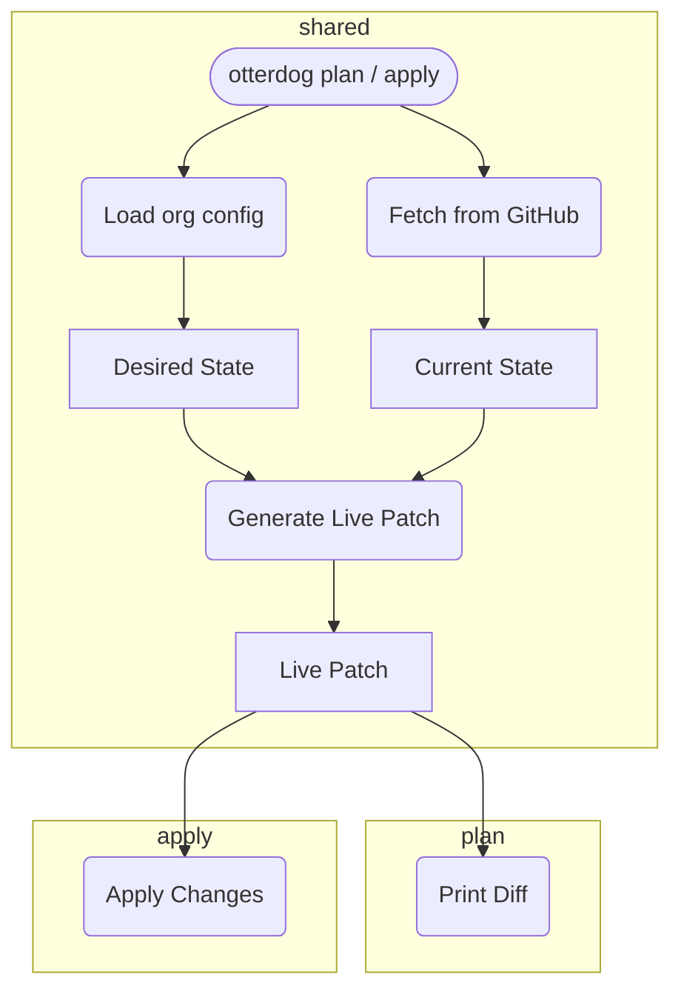

# Otterdog Architecture

!!! warning "Fair warning"

    This *looks* complex. It **is** complex. But reading this page a few times is better than randomly poking at the code for weeks.

---

## otterdog plan & otterdog apply

### Overview
Otterdog is a **stateless GitHub Infrastructure-as-Code tool**.

At a high level it:

1. Reads org-level configuration (JSON / Jsonnet)
2. Builds a **desired** in-memory model
3. Fetches the **actual** state from GitHub via providers
4. Computes a structured diff in the form of **LivePatch operations**
5. Either prints the diff (`plan`) or applies it (`apply`) via GitHub APIs

**Important note:**
!!! note "Important note"

    Unlike most other infrastructure-as-code tools, `apply` does **not** apply a previously generated plan. There is **no persistent plan or state file** — `apply` recomputes the diff from the *current* GitHub state and the config at runtime. This stateless design is intentional. While it might seem vulnerable to race conditions, applying an outdated plan would be even more problematic.

---

### Load Org Config & Desired State

This phase loads the **desired state** purely from configuration files.

- Entry point:
    - `GitHubOrganization.load_from_file()` loads the org-specific config file
- Model construction:
    - Configuration data is deserialized via `from_model_data()` (inherited from `ModelObject`)
    - Each model class recursively deserializes itself and nested resources by default, treating all members as optional nested objects
    - Override `get_mapping_from_model()` in individual model classes to customize deserialization (rare)
    - The Jsonnet configuration format is designed to align closely with the ModelObject structure
- At this point:
    - No GitHub API calls have occurred
    - The in-memory model represents *what GitHub should look like*

---

### Fetch from GitHub & Current State

This phase loads the **actual (live) state** purely from GitHub.

- Entry point:
    - `GitHubOrganization.load_from_provider()` is called with the organization name and a `JsonnetConfig` for defaults
    - Multiple independent tasks are launched concurrently to retrieve all organization data
- Provider:
    - `GitHubProvider` (`otterdog/providers/github/__init__.py`) manages API interactions
    - Three sub-components query distinct APIs:
        - **REST API** (`rest/`) — classic GitHub REST endpoints
        - **GraphQL API** (`graphql.py`) — used for complex queries
        - **Web UI** (`web.py`) — for settings only available through the web interface
    - Provides `get_*` methods that return raw API responses (untyped dicts/lists)
- Model construction:
    - Each model class deserializes itself and nested resources via `from_provider_data()` (inherited from `ModelObject`)
    - By default, recursively processes all class members as optional nested objects
    - Override `get_mapping_from_provider()` in individual model classes to customize (typically required)
- Result:
    - A second in-memory model mirroring GitHub's *current* state
    - Same class structure, different data source

---

### Diff & LivePatch Generation

This is the core of Otterdog — where desired and live models are compared and converted into actionable patches.

- Entry point:
    - `DiffOperation.generate_diff()` (`otterdog/operations/diff_operation.py`)

- Patch generation:
    - Each model inherits `generate_live_patch` from `ModelObject` (`otterdog/models/__init__.py`)
    - Models can override this method for custom behavior; otherwise the inherited implementation applies
    - The inherited `generate_live_patch` method calls `get_difference_from` on the model to compare fields and produce `Change` objects:
        - Fields marked with `model_only` are excluded from diff computation
        - Custom filtering logic can be implemented by overriding `include_field_for_diff_computation` and `is_key_valid_for_diff_computation` methods
    - Differences are collected and stored in the `changes` field within the `LivePatch` object
    - Model classes serialize themselves to provider format via `to_provider_data()` (inherited from `ModelObject`)
    - By default, `to_provider_data()` recurses into all class members as optional nested objects; override `get_mapping_to_provider` in individual model classes to customize this behavior (typically required)

### Plan: Display Diff

The `LivePatch` operations are formatted and shown to the user.

- Entry point: `otterdog/operations/plan.py` (`PlanOperation` class)
- Responsibilities:
    - Format `LivePatch` operations into human-readable output
    - Show legends and summaries
    - Warn about read-only or ignored fields
    - Models contribute via `__str__` and custom formatting

This is a **rendering step only** — no GitHub changes happen here. The user reviews the diff and decides whether to apply it.

---

### Apply: Execute Changes

The user approved the changes. Time to execute them against GitHub.

- Entry point: `otterdog/operations/apply.py` (`ApplyOperation` class)
- Execution flow:
    - For each `LivePatch`, invoke `apply_live_patch()` on the corresponding model object
    - Each model class implements `apply_live_patch()` to translate the patch into the correct GitHub API operations
    - Operations are executed via the provider (REST, GraphQL, or web UI as appropriate)
