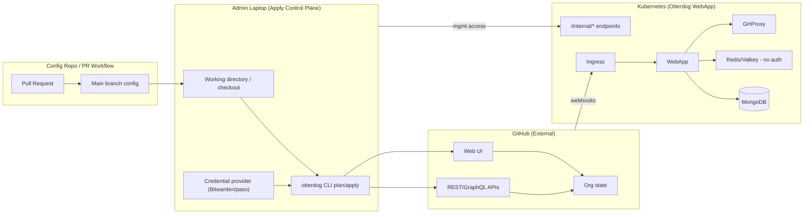

# Threat Model: Otterdog (CLI + WebApp)

## 1. Purpose

This document models threats for operating GitHub organizations using otterdog in two modes:

1. otterdog CLI used from admin laptops (`plan`/`apply`)
2. Otterdog WebApp deployed in Kubernetes (webhooks + sync/validation + persistence)

Goal: protect GitHub organization integrity, minimize credential blast radius, ensure strong governance over configuration changes, and provide adequate auditability for all applies.

## 2. System overview

Otterdog is a stateless GitHub infrastructure-as-code tool. It reads org-level configuration (JSON/Jsonnet), builds an in-memory desired model, fetches live state from GitHub via providers, computes a diff as “LivePatch” operations, then prints (`plan`) or executes (`apply`) changes. ([otterdog.readthedocs.io][1])

Important behavior: `apply` does not consume a previously generated plan; it recomputes the diff at runtime and does not keep a persistent state/plan file. ([otterdog.readthedocs.io][1])

Otterdog fetches data via multiple provider paths, including GitHub REST API, GitHub GraphQL API, and GitHub Web UI (for settings not accessible via APIs). ([otterdog.readthedocs.io][1])

Operational model (typical): configuration is hosted in a repository; contributors propose changes via pull requests; changes are approved and then applied manually using the CLI. ([otterdog.readthedocs.io][2])

## 3. Scope

### In scope

* Integrity of GitHub org settings managed by otterdog configuration
* Confidentiality and integrity of credentials used by CLI and WebApp
* Configuration repository governance and CI validation/policy checks
* WebApp deployment hardening (ingress, internal endpoints, persistence dependencies)
* Auditability of “who approved what” and “who applied what”
* Availability risks that prevent managing orgs or cause disruption

### Out of scope (explicitly)

* Exploits in GitHub itself (treated as external dependency)
* Physical threats beyond standard enterprise endpoint controls
* Unrelated SDLC risks not interacting with otterdog (unless you extend this model)

## 4. Assumptions and constraints

A1. Applies run from admin laptops (not a controlled CI runner). This makes endpoint compromise a primary risk driver.

A2. Some settings require GitHub Web UI access; otterdog “Quick Setup” explicitly calls for username/password and a 2FA TOTP seed to access settings not available via REST/GraphQL. ([otterdog.readthedocs.io][3])

A3. The documented GitHub PAT scopes include `delete_repo` (high blast radius). ([otterdog.readthedocs.io][3])

A4. WebApp dependencies include MongoDB and Redis/Valkey; the install guide states Redis/Valkey “must be configured without authentication” (GHProxy limitation). ([otterdog.readthedocs.io][4])

A5. WebApp exposes internal management endpoints under `/internal/`, including an initialization endpoint `/internal/init`, and the install guide recommends restricting internal endpoints via ingress rules. ([otterdog.readthedocs.io][4])

## 5. Assets (what must be protected)

### A. GitHub organization integrity (highest priority)

* Org owners/admins, custom roles, and membership
* Teams and team permissions
* Repository settings, branch protections/rulesets, environments
* Organization and repository webhooks
* Organization/repository secrets and variables (note: secret values are not retrievable from GitHub after creation; configuration must reference real values via a credential provider). ([otterdog.readthedocs.io][5])

### B. Credential material (“tier-0 secrets”)

CLI side:

* GitHub username/password and 2FA TOTP seed used for Web UI scraping ([otterdog.readthedocs.io][3])
* GitHub PAT and its scopes (notably `delete_repo`) ([otterdog.readthedocs.io][3])
* Credential provider session tokens (Bitwarden/pass)

WebApp side:

* GitHub App private key, webhook secret, config token (base64 in example `values.yaml`) ([otterdog.readthedocs.io][4])
* DB/cache connectivity secrets (MongoDB URI, Redis URI)

### C. Configuration repository integrity

* Jsonnet/JSON files defining desired state
* Defaults templates and imports
* CI policy/validation logic

### D. Audit evidence

* Records linking: config commit → plan/apply output → operator identity → resulting org changes

### E. Availability

* Ability to run plan/apply when needed
* WebApp availability (webhook handling, sync, persistence)

## 6. Trust boundaries and data flows

### Key trust boundaries

TB1. Admin laptop boundary (endpoint integrity, local filesystem, credential tooling)
TB2. Config repository boundary (PRs, reviews, CI checks, merge protection)
TB3. Network boundary to GitHub (API + Web UI automation)
TB4. Kubernetes cluster boundary (WebApp ingress, internal endpoints, service-to-service traffic)
TB5. Persistence boundary (MongoDB, Redis/Valkey without auth) ([otterdog.readthedocs.io][4])

### Data flow diagram (DFD)

Implementation notes:

* CLI fetches state using REST/GraphQL/Web UI providers. ([otterdog.readthedocs.io][1])
* WebApp requires `/internal/init` after deployment and on some updates. ([otterdog.readthedocs.io][4])

## 7. Entry points and attack surfaces

Admin laptop / CLI:

* `otterdog` execution environment and local repo checkout
* Local secrets handling and credential provider integrations
* Any storage of credentials in `otterdog.json` (risk: “plain” provider)
* Network access from laptop to GitHub, and potentially to WebApp internal endpoints

Config repo:

* Pull requests and merges (governance and CI enforcement)
* Jsonnet evaluation and imports

WebApp:

* Public ingress endpoints (webhooks, UI)
* `/internal/*` endpoints (must be restricted) ([otterdog.readthedocs.io][4])
* Redis/Valkey unauthenticated access (compensate with network isolation) ([otterdog.readthedocs.io][4])
* MongoDB credentials and exposure

## 8. Threat analysis (STRIDE)

This section lists realistic threats for your setup and recommended controls. Severity assumes admin laptops are used for apply.

### 8.1 Spoofing (impersonation)

Threat S1: Theft of CLI credentials (PAT, password, TOTP seed) enables attacker to impersonate an org admin and apply arbitrary changes. Otterdog explicitly documents username/password/2FA seed usage for Web UI settings. ([otterdog.readthedocs.io][3])
Controls:

* Prohibit storing credentials via `provider: "plain"` beyond experimentation; docs warn not to use it broadly due to leakage risk. ([otterdog.readthedocs.io][3])
* Store credentials only in vault-backed providers (Bitwarden/pass) and enforce vault MFA and device posture checks.
* Treat TOTP seed as tier-0: minimize who can retrieve it, do not export to disk, rotate on any suspicion of endpoint compromise.
* Use a dedicated service account for otterdog operations; do not reuse personal admin accounts for apply.

Threat S2: WebApp GitHub App private key compromise enables attacker to mint installation tokens and operate with app permissions. WebApp install guide instructs storing GitHub App private key in values.yaml (base64). ([otterdog.readthedocs.io][4])
Controls:

* Store app private key in a proper secret manager / sealed secrets; never commit values containing secrets.
* Rotate webhook secret and app private key after incidents; restrict access to the secret material to cluster operators only.

Threat S3: Forged/replayed webhooks to WebApp
Controls:

* Ensure webhook signature verification is enabled and secrets are rotated.
* Add replay protections if you have an edge proxy (timestamp tolerance, rate limits).

### 8.2 Tampering (unauthorized modification)

Threat T1: Malicious config PR weakens org security (e.g., new webhook, reduced ruleset/branch requirements, elevated bypass actors)
Controls:

* Treat config merges as privileged production changes:

  * CODEOWNERS requiring security/admin reviews
  * required CI checks + branch protection
  * no self-approval on high-impact paths
* Add CI “policy checks” that fail PRs which:

  * add org/repo webhooks without explicit allowlist approval
  * reduce branch protection/ruleset requirements
  * broaden bypass actor lists
* Require “apply operator” separation for sensitive changes (approver ≠ applier).

Threat T2: Local tampering on admin laptop (malware modifies config checkout or otterdog binary)
Controls:

* Use a dedicated hardened apply environment (separate OS user / VM / laptop) with minimal software.
* Prefer pinned versions / checksums for otterdog installation (package locking and signed releases where available).
* Require `apply` to reference an explicit config commit SHA (not “whatever is in the working tree”).

Threat T3: Redis/Valkey manipulation in-cluster (queue/cache poisoning)
The install guide states Redis/Valkey must be deployed without authentication. ([otterdog.readthedocs.io][4])
Controls (compensating):

* Strict NetworkPolicies: only WebApp/GHProxy pods can reach Redis/Valkey.
* Namespace isolation and RBAC: prevent arbitrary pod creation in the same namespace.
* Monitor and alert on unusual Redis command patterns / spikes.

Threat T4: Abuse of `/internal/*` management endpoints (init/maintenance actions)
Docs instruct restricting `/internal/` endpoints and show ingress allowlist examples; init uses `/internal/init`. ([otterdog.readthedocs.io][4])
Controls:

* Restrict `/internal/*` at ingress to a management CIDR/VPN only.
* Add another auth layer (mTLS or an auth proxy) if feasible.
* Alert on any access to `/internal/*`.

### 8.3 Repudiation (denying actions)

Threat R1: No reliable evidence of who ran `apply` from an admin laptop
Controls:

* Standardize a wrapper script for applies that logs:

  * operator identity
  * config repo and commit SHA
  * timestamp
  * command-line args
  * plan/apply output (or hash + storage location)
* Send logs to a central, immutable store (SIEM).
* Correlate with GitHub audit log events for key changes (admins, webhooks, rulesets).

### 8.4 Information disclosure

Threat I1: Credential leakage via `plain` provider in `otterdog.json`
Docs explicitly warn: do not use `plain` beyond quick setup to avoid leakage if the file is shared. ([otterdog.readthedocs.io][3])
Controls:

* Ban `provider: plain` in repo policy checks; enforce via CI.
* Require vault-backed providers.

Threat I2: Leakage of TOTP seed (MFA bypass)
Otterdog documents storing `twofa_seed` / `totp` for GitHub Web UI access. ([otterdog.readthedocs.io][3])
Controls:

* Tier-0 handling: least access, audit retrieval, rotate on compromise.
* Avoid printing or logging secrets; ensure wrapper scripts redact.

Threat I3: Secrets embedded in WebApp Helm values (configToken/webhookSecret/appPrivateKey shown in example) ([otterdog.readthedocs.io][4])
Controls:

* Externalize secrets: do not commit them; use Kubernetes external secrets or sealed secrets.
* Scan repos for accidental secret commits (secret scanning + pre-commit hooks).

### 8.5 Denial of service

Threat D1: Broad PAT scopes allow destructive operations (`delete_repo`) causing org-wide disruption ([otterdog.readthedocs.io][3])
Controls:

* Remove `delete_repo` scope unless you explicitly need repo deletions.
* Split credentials:

  * “routine” token: minimal scopes needed for normal operation
  * “break-glass” token: destructive scopes; time-limited access and extra approvals

Threat D2: Webhook flooding / GitHub rate limiting affects WebApp and/or admin workflows
Controls:

* Rate-limit ingress, validate signatures early.
* Monitor GitHub API rate usage and backoff handling.

### 8.6 Elevation of privilege

Threat E1: Anyone who can merge config effectively controls org state (because apply enforces desired state)
Controls:

* Tighten merge permissions and enforce least privilege.
* Require security review for changes to roles/admins, webhooks, bypass settings, and rulesets.

Threat E2: Admin laptop compromise becomes org-admin compromise (because apply runs there)
Controls:

* Harden apply endpoints (dedicated system, EDR, patching, minimal apps).
* Do not use apply endpoint for daily browsing/email.
* Device posture requirements for vault access.

## 9. Risk register (starter)

| ID   | Risk                                                      | Likelihood |   Impact | Priority | Key mitigations                                                  |
| ---- | --------------------------------------------------------- | ---------: | -------: | -------: | ---------------------------------------------------------------- |
| R-01 | Admin laptop compromise steals PAT + password + TOTP seed |       High | Critical |       P0 | Dedicated apply endpoint, vault-only creds, tier-0 controls, EDR |
| R-02 | Malicious config PR weakens org protections               |     Medium | Critical |       P0 | CODEOWNERS, policy checks, separation of duties                  |
| R-03 | `/internal/*` endpoint reachable beyond mgmt plane        |     Medium |     High |       P1 | Ingress allowlist + auth proxy + alerting                        |
| R-04 | Redis/Valkey abuse in-cluster (no auth)                   |     Medium |     High |       P1 | NetworkPolicies + namespace isolation + monitoring               |
| R-05 | Over-scoped PAT includes `delete_repo`                    |     Medium | Critical |       P0 | Remove scope, split tokens, break-glass process                  |
| R-06 | Lack of apply audit trail                                 |       High |   Medium |       P1 | Wrapper logging + immutable central store + correlation          |

## 10. Security requirements (opinionated baseline)

### 10.1 Credential handling (MUST)

* Do not use the `plain` credential provider outside of ephemeral experimentation; enforce via CI/policy checks. ([otterdog.readthedocs.io][3])
* Vault-backed credentials only (Bitwarden/pass).
* TOTP seed treated as tier-0 secret: least access, audited retrieval, fast rotation procedure. ([otterdog.readthedocs.io][3])
* Remove `delete_repo` scope unless required; use separate “break-glass” credentials for destructive actions. ([otterdog.readthedocs.io][3])

### 10.2 Admin laptop apply controls (MUST)

* Applies must run on a dedicated apply environment (separate machine/VM or hardened OS profile).
* Applies must reference an explicit config commit SHA and clean working tree.
* Operator must run `plan` immediately before `apply` (same commit, same environment).
* Store apply logs centrally (operator, commit SHA, output hash, timestamp).

### 10.3 Config repo governance (MUST)

* Branch protection on main:

  * required reviews (CODEOWNERS)
  * required CI status checks (syntax + policy)
  * restrict who can merge
* CI policy rules must block:

  * new webhooks without explicit approval
  * reductions in ruleset/protection strictness
  * expansions of bypass actors and admin roles without security approval

### 10.4 WebApp hardening (MUST)

* Restrict `/internal/*` endpoints to management network only (ingress allowlist); document the management access path. ([otterdog.readthedocs.io][4])
* Treat `/internal/init` as a privileged operation; alert on execution. ([otterdog.readthedocs.io][4])
* Network isolate Redis/Valkey given “no auth” constraint; only allow access from required pods/services. ([otterdog.readthedocs.io][4])
* Keep secrets out of Git: use external secrets, sealed secrets, or equivalent.

## 11. Operational playbooks (minimum)

### 11.1 Suspected admin laptop compromise

1. Revoke GitHub PAT(s) used by otterdog; rotate password; rotate TOTP seed. ([otterdog.readthedocs.io][3])
2. Rotate WebApp secrets if laptop had any access (webhook secret, app key) ([otterdog.readthedocs.io][4])
3. Review GitHub audit log for role/webhook/ruleset changes
4. Re-establish known-good state:

   * pull last approved config commit
   * run `plan` and `apply` from a clean trusted environment

### 11.2 Suspicious WebApp behavior

1. Block ingress access to `/internal/*` and verify allowlists ([otterdog.readthedocs.io][4])
2. Inspect cluster logs for `/internal/init` calls and anomalous Redis traffic
3. Rotate GitHub App private key and webhook secret if tampering suspected ([otterdog.readthedocs.io][4])

## 12. Residual risks (explicitly accepted or to be reduced)

* Storing/using a TOTP seed as automation input is inherently high risk because it can bypass MFA if stolen. This is required for Web UI-only settings in the documented setup. ([otterdog.readthedocs.io][3])
* Redis/Valkey without authentication is an architectural constraint in the documented WebApp deployment; accept only with strong network isolation. ([otterdog.readthedocs.io][4])
* “Apply from laptops” remains higher risk than “apply from a controlled CI runner.” If requirements change, migrating apply into a hardened CI environment is the single biggest risk reducer.

## 13. Appendix: Security invariants to encode in CI (examples)

These are intentionally strict “guardrails” you can implement as CI policy checks:

* Webhooks: no new org/repo webhooks without allowlisted destinations and security approval.
* Rulesets/branch protections:

  * cannot reduce required checks
  * cannot add bypass actors beyond an allowlist
  * cannot enable force pushes / deletions (unless explicitly approved)
* Admin roles:

  * cannot add org owners/admins except via an allowlisted process
* Tokens/scopes:

  * configs must not reference `provider: plain` ([otterdog.readthedocs.io][3])
  * break-glass credentials must not be used by default in daily workflows

[1]: https://otterdog.readthedocs.io/en/latest/developing_otterdog/architecture/ "Architecture - otterdog"
[2]: https://otterdog.readthedocs.io/ "Overview - otterdog"
[3]: https://otterdog.readthedocs.io/en/latest/operating_otterdog/setup/ "Quick Setup - otterdog"
[4]: https://otterdog.readthedocs.io/en/latest/operating_otterdog/install/ "Install - otterdog"
[5]: https://otterdog.readthedocs.io/en/latest/reference/organization/secret/ "Organization Secret - otterdog"
